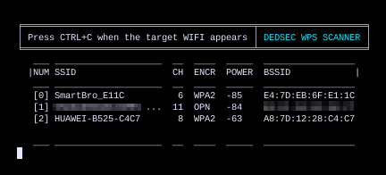
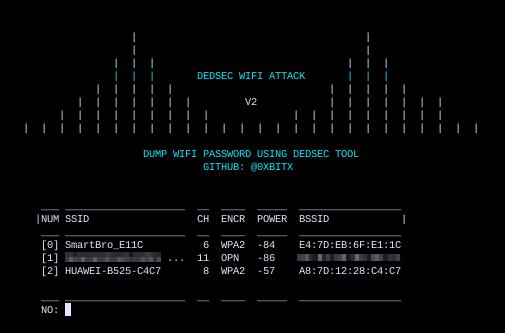
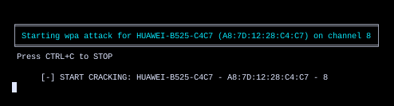
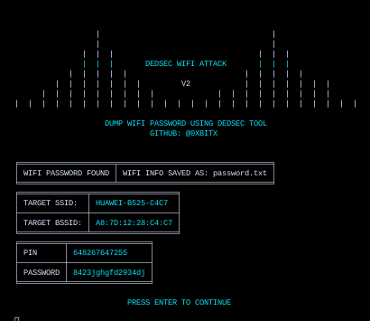

<h1 align="center"> DEDSEC WIFI V2 </h1>

 DEDSECWIFI has been designed to be a robust and practical attack against Wi-Fi Protected Setup (WPS) registrar PINs in order to recover WPA/WPA2 passphrases. It has been tested against a wide variety of access points and WPS implementations. 

### DESCRIPTION
DEDSECWIFI is a linux-based tool designed for targeted attacks on Wi-Fi Protected Setup (WPS) registrar PINs, aiming to recover WPA/WPA2 passphrases. Through extensive testing on various access points and WPS implementations, DEDSECWIFI has proven its effectiveness and reliability. With a user-friendly interface, it provides a practical solution for security professionals engaged in ethical hacking, penetration testing, and security assessments. Users can responsibly leverage DEDSECWIFI to enhance their understanding of Wi-Fi vulnerabilities while ensuring compliance with legal standards and privacy considerations.

<h1 align="center"> SCREENSHOTS </h1>

### INSTALLATION
    * git clone https://github.com/0xbitx/Dedsec-WifiV2.git
    * cd Dedsec-WifiV2
    * chmod +x dedsec-wifi-v2
    * sudo ./dedsec-wifi-v2

### TESTED ON FOLLOWING:
* Kali Linux
* Parrot OS
* Ubuntu

### PREREQUISITES
* sudo - [ MUST ]

## Support

If you find my work helpful and want to support me, consider making a donation. Your contribution will help me continue working on open-source projects.

**Bitcoin Address: `36ALguYpTgFF3RztL4h2uFb3cRMzQALAcm`**

<h1 align="center"> DISCLAIMER </h1>

<h4 align="center">I'm not responsible for anything you do with this program, so please only use it for good and educational purposes. </h4>

