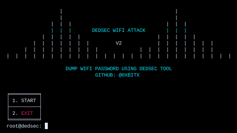

<h1 align="center"> DEDSEC WIFI V2 </h1>

 DEDSECWIFI has been designed to be a robust and practical attack against Wi-Fi Protected Setup (WPS) registrar PINs in order to recover WPA/WPA2 passphrases. It has been tested against a wide variety of access points and WPS implementations. 

### INSTALLATION
* git clone https://github.com/0xbitx/Dedsec-WifiV2.git
* cd Dedsec-WifiV2
* sudo python3 dedsec-wifi-v2.py

### TESTED ON FOLLOWING:
* Kali Linux
* Parrot OS
* Ubuntu

### PREREQUISITES
* sudo - [ MUST ]

### LANGUAGE 
* python

<h1 align="center"> DISCLAIMER </h1>

<h4 align="center">I'm not responsible for anything you do with this program, so please only use it for good and educational purposes. </h4>
